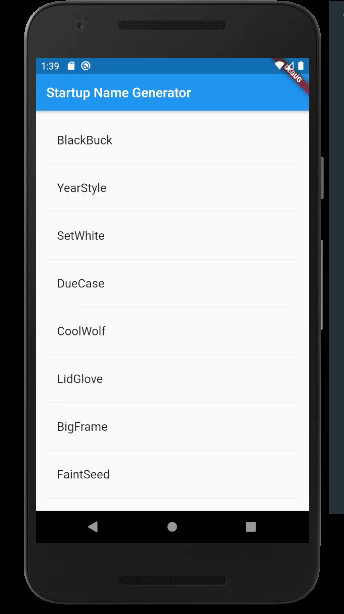
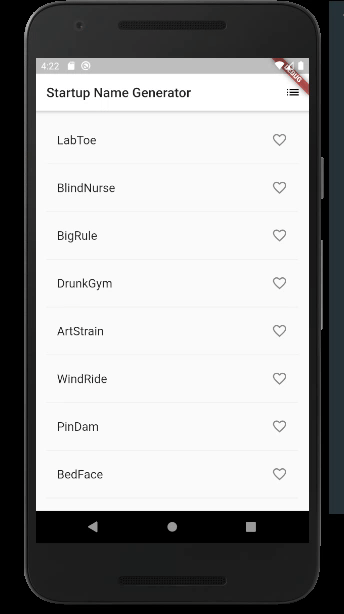
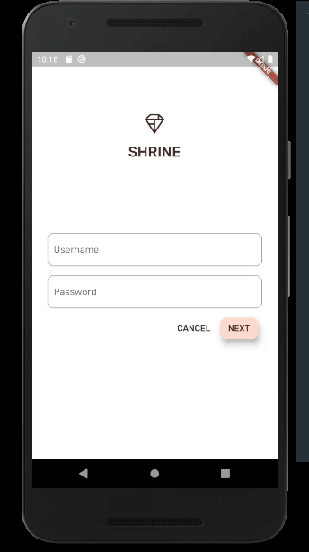

## Flutter Codelabs Series

- [x]   [Write your first Flutter app, part 1](https://codelabs.developers.google.com/codelabs/first-flutter-app-pt1/index.html?index=..%2F..index#0)

- [x]   [Write your first Flutter app, part 2](https://codelabs.developers.google.com/codelabs/first-flutter-app-pt2/index.html?index=..%2F..index#0)

- [x]   [MDC-101 Flutter: Material Components (MDC) Basics (Flutter)](https://codelabs.developers.google.com/codelabs/mdc-101-flutter/index.html?index=..%2F..index#0)

- [x]   [MDC-102 Flutter: Material Structure and Layout (Flutter)](https://codelabs.developers.google.com/codelabs/mdc-102-flutter/index.html?index=..%2F..index#0)

- [x]   [MDC-103 Flutter: Material Theming with Color, Shape, Elevation, and Type (Flutter)](https://codelabs.developers.google.com/codelabs/mdc-103-flutter/index.html?index=..%2F..index#0)

- [x]   [MDC-104 Flutter: Material Advanced Components (Flutter)](https://codelabs.developers.google.com/codelabs/mdc-104-flutter/index.html?index=..%2F..index#0)

